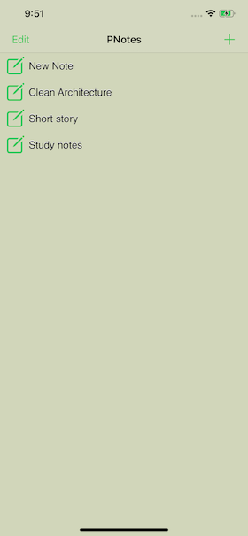
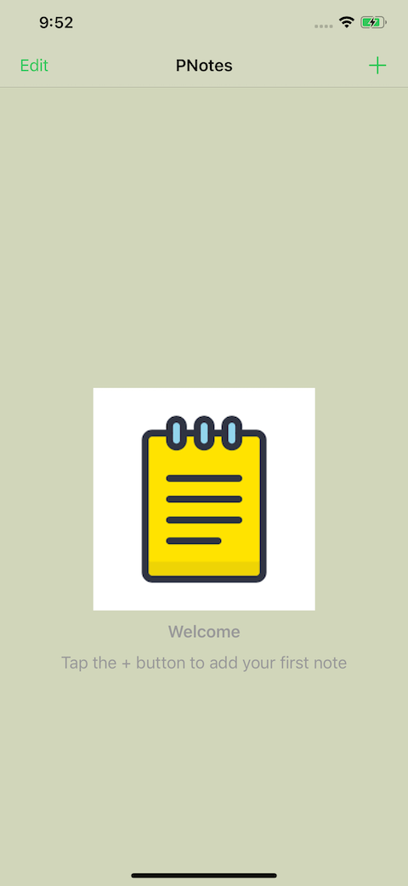

# PNotes-swift-mvvm
 ## Features
 - Add new note
 - Edit note
 - Delete note
 - Offline storage
## External libraries used
 - Realm https://realm.io/docs/swift/latest
 - DZN EmptyData Set https://github.com/dzenbot/DZNEmptyDataSet

 | width=100
 | width=100
 
Please run pod install before building the project.
